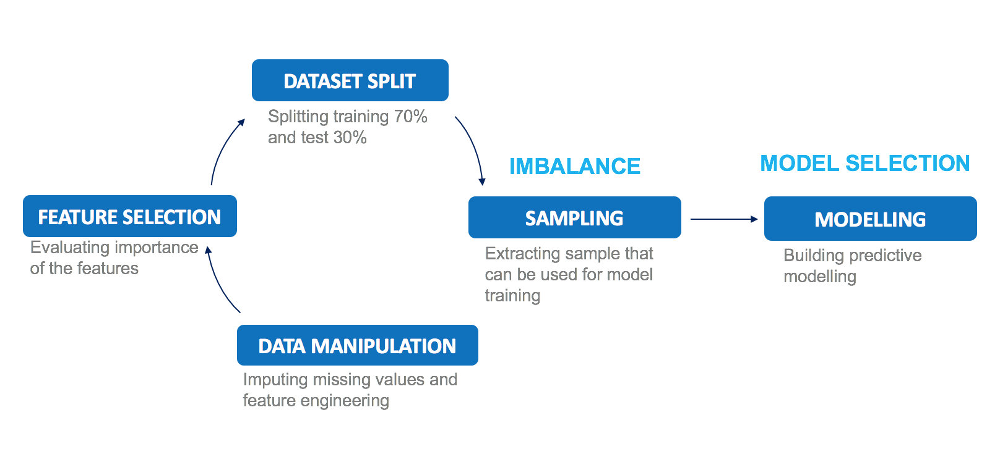

## Google Analytics Customer Revenue Prediction
Bentley University MA710(Data Mining) - Final Group Project  

      The best single model we have obtained is an XGBoost model with the under sampled data of RMSE 1.31

### The Task

In this project, we're challenged to analyze a Google Merchandise Store (also known as GStore, where Google swag is sold) customer dataset to predict revenue per customer.

### The Dataset

Each row in the dataset is one visit to the store, all unique `fullVisitorIds` will correspond to a row in the submission.
There are multiple columns which contain JSON blobs of varying depth. In one of those JSON columns, totals, the sub-column 
`transactionRevenue` contains the revenue information we are trying to predict. 
    *We predicted the natural log of the sum of all transactions per user.*
    
We only used the traning dataset `train_v2.csv` for the project, and split it into 70% training and 30% testing [(source)](https://www.kaggle.com/c/ga-customer-revenue-prediction/data)  

      Initial dataset contains over 900,000 rows and 55 arributes after flatten the JSON columns

 Below is the The data fields in the given files:  

* `fullVisitorId`- A unique identifier for each user of the Google Merchandise Store.
 * `channelGrouping` - The channel via which the user came to the Store.
  * `date` - The date on which the user visited the Store.
  * `device` - The specifications for the device used to access the Store.
  * `geoNetwork` - This section contains information about the geography of the user.
  * `sessionId` - A unique identifier for this visit to the store.
  * `socialEngagementType` - Engagement type, either "Socially Engaged" or "Not Socially Engaged".
* `totals` - This section contains aggregate values across the session.
* `trafficSource` - This section contains information about the Traffic Source from which the session originated.
* `visitId` - An identifier for this session. This is part of the value usually stored as the _utmb cookie.   
             This is only unique to the user. For a completely unique ID, you should use a combination of fullVisitorId and visitId.
* `visitNumber` - The session number for this user. If this is the first session, then this is set to 1.
* `visitStartTime` - The timestamp (expressed as POSIX time).

### Roadmap

